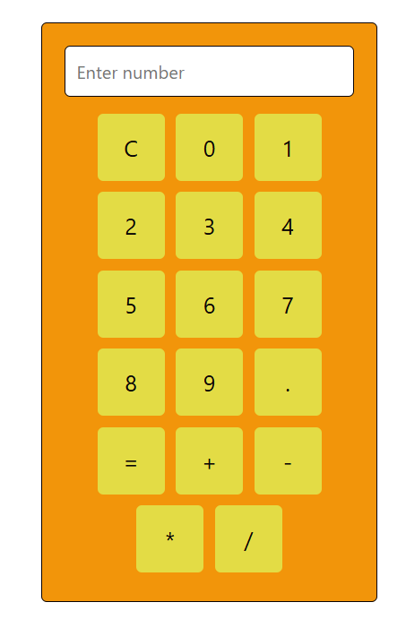
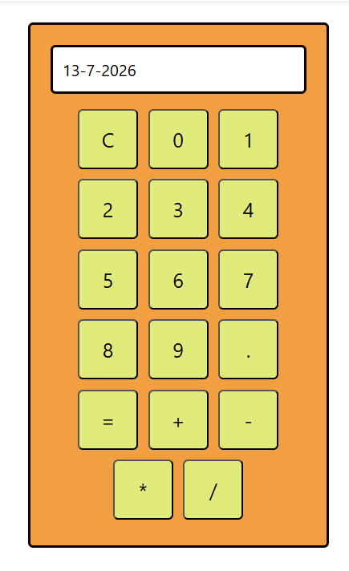
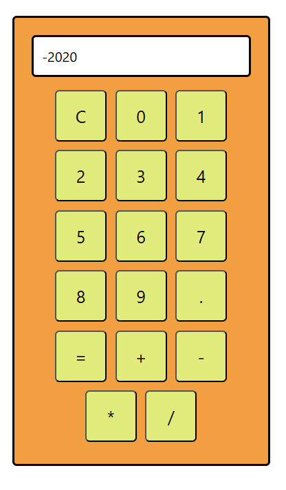

# 🧮 React Calculator

A simple and responsive calculator application built using **React.js**. It performs basic arithmetic operations with a clean user interface and demonstrates React concepts such as **Components**, **Props**, **State Management**, and **Event Handling**.

---

## 🚀 Features

- ➕ Addition
- ➖ Subtraction
- ✖️ Multiplication
- ➗ Division
- 🔢 Decimal number support
- 🧹 Clear (`C`) button
- ⚡ Instant calculation using `=`
- 📱 Responsive and clean UI

---

## 🛠️ Tech Stack

- React.js
- JavaScript (ES6)
- CSS Modules
- Vite

---

## 📂 Project Structure

```
Calculator-version-1/
│── src/
│   ├── Components/
│   │   ├── Buttons.jsx
│   │   ├── Buttons.module.css
│   │   ├── Display.jsx
│   │   └── Display.module.css
│   ├── App.jsx
│   ├── App.module.css
│   └── main.jsx
│
├── public/
├── package.json
├── vite.config.js
└── README.md
```

---

## 📸 Screenshots

### 🏠 Initial Calculator



---

### 🧮 Final Calculator



---

### ✅ Result



---

## ⚙️ Installation

Navigate to the project

```bash
cd Calculator-version-1
```

Install dependencies

```bash
npm install
```

Start the development server

```bash
npm run dev
```

---

## 💡 Concepts Used

- Functional Components
- JSX
- CSS Modules
- React Props
- React State (`useState`)
- Event Handling
- Array Mapping (`map()`)
- Conditional Logic

---

## 🎯 Future Improvements

- ⌫ Backspace Button
- 📜 Calculation History
- 🌙 Dark Mode
- ⌨️ Keyboard Support
- ❌ Remove usage of `eval()`
- 🧠 Custom Expression Parser

---

## 👨‍💻 Author

**Shivmohan Chaurasia**
**CSE (AIML)**

- GitHub: https://github.com/shivmohan0035

---

## ⭐ Support

If you found this project helpful, consider giving it a ⭐ on GitHub.
